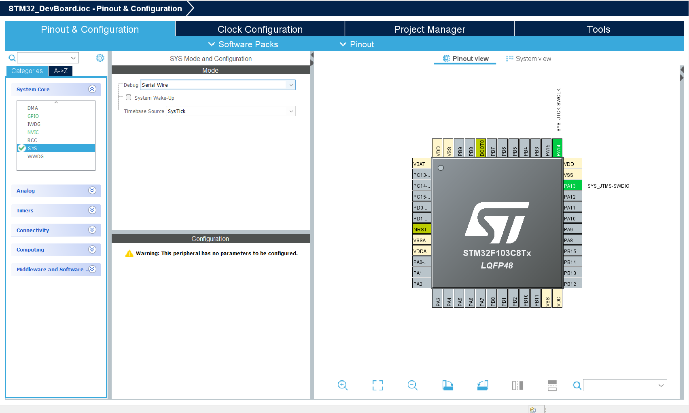
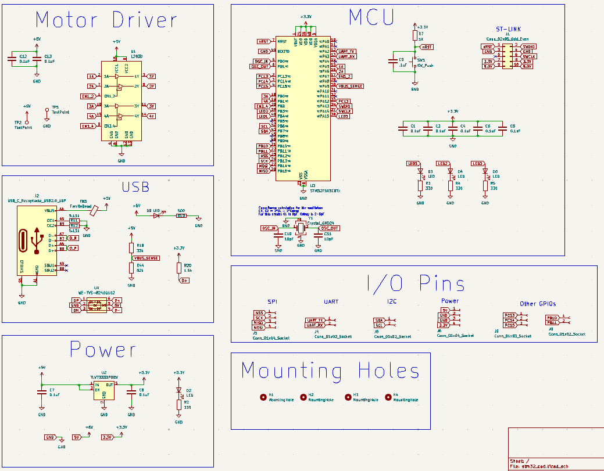
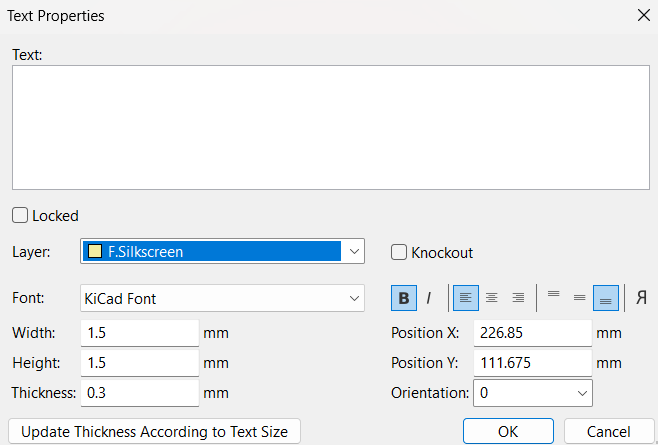

# ECE 445 CAD Assignment

## Setting up your microcontroller configuration

The first step of STM32 based development is to use the SMT32Cube IDE to 

### Workspace and project Setup
1. Open STM32CubeIDE

2. Select a workspace
3. "Start new project"
4. Select STM32F103C8T6

5. Name your project, click yes when asked to open in device configuration view


### Configure microcontroller
- For this project, we will be adding Serial Wire Debug (SWD), USB CDC, I2C, SPI, UART, and several GPIO pins


#### Serial Wire Debug (SWD)
- `System Core` -> `SYS` -> `Serial Wire`


#### USB Communication Device Class (USB CDC)
- `Connectivity` -> `USB` -> Enable `Device (FS)`

- `Middleware and Software` -> `USB_DEVICE` -> `Class for FS IP` -> `Communication Device Class (Virtual Port Com)`


#### Clock Configuration pt 1
- Go to the Clock Configuration tab. Notice that when you click "Resolve Clock Issues" it cannot. We need to use an external clock source to get a higher frequency signal for the USB clock.


#### External Oscillator (for USB)
- `System Core` -> `RCC` -> `High Speed Clock` -> `Crystal/Ceramic Resonator`


#### Clock Configuration pt 2
- Go to the Clock Configuration tab. Next to HSE make sure you enter 8 MHz. This will be the frequency of our crystal oscillator. Now run "Resolve Clock Issues". It will not give any errors.


#### Inter-Intergrated Circuit (I2C)
- I2C is a adress-based bus communication protocol. It uses 2 wires (Clock and Data) to connect to several devices. Every message sent has an address, and the device with that address stores the incoming message.
- `Connectivity` -> `I2C1` -> `I2C`


#### Serial Peripheral Interface (SPI)
- SPI is a full duplex digital communication protocol which uses a select wire (typically CS or SS) to select which device to send signals to.
- `Connectivity` -> `SPI2` -> `Full Duplex Master` and `Hardware NSS Output Signal`


#### Universal Synchronous Asynchronous Receiver/Transmitter (USART)
- USART is a full duplex, (typically) asynchronous digital communication protocol. The communicating devices must be set to have the same data rates and data can be received and transmitted simultenously(full duplex) on 2 different wires. TX (transmit) from one device should be attached to RX (receive) on the other device and vice versa.
- `Connectivity` -> `USART2`


#### General Purpose Input/Output (GPIO)
- GPIOs can be either analog (taking values between 0 and 3.3V) or digital (either 0 or 3.3V) and are used for controlling peripheral devices. In this case, an H-bridge motor driver (L293D).
- Left click on pins PA5, PA6, PA7, PB0, PB1, PB2, PB3, PB4, PA15 and select GPIO Output
- Right click on pins PA5, PA6, PA7, PB0, PB1, PB2, PB3, PB4, PA15 and Enter User Label. Name them as EN3_4, _2A, _3A, _1A, _4A, and EN1_2, LED2, LED1, LED3 respectively.

**It is best to have an idea of how your peripheral ICs have their pins physically arranged, that way you can label your MCU pins to that they line up and do not have to criss-cross traces later on.**

The IC should now look like:


#### Code Generation
Click the Device Configuration Tool Code Generation icon and click yes. This generates the starter code, we will return here later.

## KiCAD Schematic

1. [Download](https://www.kicad.org/download/) and open KiCAD 9.0
2. File -> New Project -> Select location and name it
3. Open the .kicad_sch file, this is the schematic
4. Go to File -> Page Settings -> Size: A3

The schematic is a way to visually represent connections in an electrical circuit. The "wires" or "nets" are labels that are attached to "pins" on "symbols"(components). Once you have instantiated all of the components and defined all of the "nets" connecting these components, you will assign physical models to the components and then do layout (physical arrangement).

### Keyboard Shortcuts
- To draw a wire, press `W`
- To rotate a part, press `R`. This applies in layout and schematic.
- To change a value (Ohms, Farads, etc.), hover over the symbol and press `V`
- To place a symbol, either press `A` or click the Op-Amp button on the right panel (top arrow)
- To place a global label, either press `Ctrl+L` or global label button (bottom arrow)
- To place a power symbol press `P` or select the ground symbol button on the right panel (middle arrow)


### Power Subsystem
- We will be (primarily) powering the board via USB C cable when we are not programming the board.

- Place the following:
- 3.3V, 5V, and GND Power Symbols
- 3.3V, 5V, and GND Global Labels
*We connect the power symbol and the labels together so we can use either throughout the design and have it mean the same thing*

- 3.3V Low Dropout Regulator: `TLV73333PDBV`
- 2x Generic Capacitor: `C` 
- Generic Resistor: `R`
- Generic LED: `LED`

- Double click on the capacitor and set value to `0.1uF`
- Double click on the resistor and set value to `3.3V`

Make sure the values for passive components and labels reflect the below image.


### USB Subsystem
- We will be using a USB C connector for power and also for Virtual COM Port serial communication. The ESD protection diode is used to protect the MCU from charge buildup from inserting and removing the USB cable. The ferrite bead is to filter electrical noise on the USB cable. The 1.5k Ohm resistor is used to pull up the D+ line, which allows for differential signaling, which is foundational to USB communication.

- Place the following:
- 3.3V, 5V, and GND Power Symbols
- 3.3V, 5V, and GND Global Labels
- USB-C Port: `USB_C_Receptacle_USB2.0_16P`
- Electrostatic Discharge Diode: `WE-TVS-82400102`
- 2x Generic Capacitors: `C` 
- Generic Resistor: `R`
- Generic LED: `LED`
- Generic Ferrite Bead: `FerriteBead`

Make sure the values for passive components and labels reflect the below image.


### Motor Driver Subsystem
- We will be using a [Quadruple Half-H Driver] (https://www.ti.com/lit/ds/symlink/l293d.pdf?ts=1749559495468&ref_url=https%253A%252F%252Fwww.ti.com%252Fproduct%252FL293D) to create up to 2 H-bridges. One H bridge is capable of spinning a brushed DC motor or controlling a single phase of a multi-phase motor (stepper, brushless, etc.). For higher current requirements, you can solder on larger gauge wires to the test pads.

- Place the following:
- 5V and GND Power Symbols
- L293D IC: `L293D`
- 2x Generic Capacitors: `C` 
- 2x Generic Test Points: `TestPoint`

Make sure the values for passive components and labels reflect the below image.


### Input/Output Pins
We will be using socket connectors to allow communication, power, and general purpose connections to external components. 

- Place the following:
- 3.3V, 5V, and GND Global Labels
- 3x Socket 1x2 Connectors: `Conn_01x02_Socket`
- 1x Socket 1x3 Connector: `Conn_01x03_Socket`
- 2x Socket 1x4 Connectors: `Conn_01x04_Socket`

Make sure the labels reflect the below image.


### STM32 Microcontroller (MCU)
For this board, we will be using an STM32F103C8T6 MCU. This specific model and family of MCU is chosen for its industry level design tools and capabilities. As seen in the microcontroller setup in STM32CUBEIDE, there is a lot of configurability for this device. 

To program the device, we will be using an STLink, a proprietary programmer which uses Serial Wire Debug to flash code onto the MCU. 

We be placing the crystal oscillator our MCU configuration requires. 

We require decoupling capacitors to filter out noise on the MCU's power lines.

We will place a physcial reset button to control the active low nRST pin.

We will finally place 3 LEDs for debugging or displaying current states of the MCU.

- Place the following:
- 3.3V, 5V, and GND Global Labels
- STM32F103C8T6 MCU: `STM32F103C8Tx`
- 8 MHz Crystal Oscillator: `Crystal_GND24`
- Socket 2x5 Connector: `Conn_02x05_Odd_Even`
- 8x Generic Capacitors: `C`
- 4x Generic Resistors: `R`
- 3x Generic LEDs: `LED`
- Generic Switch: `SW_Push` 

Make sure the values for passive components and labels reflect the below image.


### Mounting Holes
These will allow us to attach this board to an enclosure

Place:
- 4x Generic Mounting Holes: `MountingHole`

### Complete Schematic
The schematic should now look like this:



## Assign Footprints
Now we have described our board electrically (nets). The software now knows abstractly what pins should be connected on which components. We now have to describe what each of the components will be physically, these descriptions are called footprints. Click on "Assign Footprints" on the top panel.

To assign your first footprint (capacitors for example), select the Capacitor_SMD library on the left pane. Next to "Footprint Filters", make sure the "L" icon is selected to search within the selected library and type 0805. This is the size of the component. **0805 is 1.6 mm x 0.8 mm**


- All capacitors should be `Capacitor_SMD:C_0805_2012Metric`


- All LEDs should be `LED_SMD:LED_0805_2012Metric`
- The ferrite bead should be `Resistor_SMD:R_0805_2012Metric` (This is physically accurate, but a ferrite bead not is not functionally the same as a resistor)
- The mounting holes should be `MountingHole:MountingHole_3.2mm_M3`


- The 02x05 connector should be `Connector_PinSocket_2.54mm:PinSocket_2x05_P2.54mm_Vertical`
- The USB connector should be `Connector_USB:USB_C_Receptacle_GCT_USB4085`
- The 01x04 connectors should be `Connector_PinSocket_2.54mm:PinSocket_1x04_P2.54mm_Vertical`
- The 01x03 connector should be `Connector_PinSocket_2.54mm:PinSocket_1x03_P2.54mm_Vertical`
- The 01x02 connectors should be `Connector_PinSocket_2.54mm:PinSocket_1x02_P2.54mm_Vertical`
- All resistors should be `Resistor_SMD:R_0805_2012Metric`


- The button should be `Button_Switch_SMD:SW_Push_SPST_NO_Alps_SKRK`
- The test points should be `TestPoint:TestPoint_Pad_4.0x4.0mm`
- The crystal should be `Crystal:Crystal_SMD_5032-4Pin_5.0x3.2mm`
- The other footprints should auto populate, if not, use the footprints shown below.


**Click Apply, Save Schematic & Continue. Then click OK**


## KiCAD Layout
We are now on layout, which is where we decide how large out board will be and where to place our components (now footprints). We will also connect all of our nets using traces. Traces can vary in width and we will have one example of that. Traces also sometimes need to be impedance matched (at high frequencies) or routed as a differential pair, we will do the latter as an example, but it is not completely necessary for our applicaiton.

1. Click "Switch to PCB Editor" on the top panel

2. Click "Update PCB from Schematic"

3. Click "Update PCB"

4. Click anywhere to drop the components. If you cannot see them, make sure your `Appearances` -> `Objects` settings look like the image below


### Defining the board size
1. `Appearance` -> `Layers` -> `Edge.Cuts`
2. Change the grid size at the top to 5.00mm
3. Select the rectangle tool and draw a 50mm x 75mm rectangle 
4. Change the grid size to 1mm and place the mounting holes at the 4 corners of the board like in the image below.


### Arranging components
Change the grid to whatever you want and arrange the rest of the components similar to shown below. You can turn off F.Fab and B.Fab to decrease cluttered text in the Appearance panel.


**Keep these considerations in mind**
1. Minimize signal (USB, UART, SPI, SWD, I2C) trace lengths
2. Minimize distance between crystal and MCU
3. Have at least 1 capacitor at each power source for MCU, LDO, and L293D
4. Keep MCU away from noisy power

Keep components grouped together similar to the schematic view can simplify your layout process
- *Hint: One way to do this is to click and drag to highlight a section in the schematic view, which will select it in the layout view also, then arrange groups of components and place them.*

### Drawing traces
All of the thin blue lines between device pins are called airwires. You will have to draw metal traces connecting the device pins until none remain. 

There is one way around this which is using vias. Vias are holes drilled into the board which are then plated with copper or filled with conductive material. We will be placing a ground plane on the bottom of the board, meaning if you place a via on the top side, it will be effectively be connected to ground. Use this to your advantage.

Set the trace width to 0.25mm for all signal traces and 1mm for all power traces (3.3V, 5V) not going to the MCU. 0.5mm is fine for power traces going to the MCU.

Ground plane: 
`Ctrl + Shift + Z` or "Draw filled zone" on right panel. Configure it as shown below.


You can draw it with endpoints anywhere it just needs to encompass the entire board. Press `B` to fill


Add another filled zone on F.Cu for 3.3V.

Once all airwires are gone your board should look similar to this:


### Design Rules Checker

#### Errors

To make sure that the board you have designed can actually be manufactured, we need to run Design Rules Checker (DRC). Note that KiCAD has default design rules (spacing of traces, sizes of vias, etc.), which differ from the manufacturer's design rules.


You will likely get errors, probably >16. You must pay attention to errors. Warnings can be benign, but you should also check them. Some of the errors you get are "Clearance Violations" due to the spacing of the USB connector pins. To resolve this, double-click on the USB connector and go to `Clearance Overrides and Settings`->`Pad Clearance` and set this to 0.15 mm.


This should greatly decrease your error count. You may also have errors related to thermal performance/relief. To resolve those, make sure power pins have multiple connections, like the USB connector shown below.


#### Warnings

Design rules violations that only have `Warning` severity will likely not impact the functionality or safety of your board. However, you must understand what your wanrings are and if they will matter during or after board fabrication. 

For example, there will be a warning: `Silkscreen clipped by board edge` because the USB connector will hang off the edge of the board. This warning can be ignored. 

There may be other "Schematic Parity" warnings where an assigned footprint doesn't match symbol's footprint filters. 

### Adding text
We will now be adding some text to the board.

Click on the "T" icon on the right side and select F.Silkscreen


You must have (but are not limited to) the following on your design:
- "CAD Assignment", Team number, "ECE 445"
- Labels for the socket outputs:`"UART", "SPI", "I2C", "5V", "3.3V", "GND"`
- Labels for motor driver outputs: `"1Y", "2Y", "3Y", "4Y"`
- Labels for the test points : `"5V", "GND"`

- Some sort of indication for ST LINK pins.

Recommended method: Small diagram using rectangles, dots, and text. Shown below


## Programming Overview

Once you have assembled the board, you will test that there are no major issues. You should test, using a multimeter in Contuinity Mode (beeps if shorted), that none 5V, 3.3V, and GND are shorted. You should also check that the MCU 3.3V is connected to the LDO 3.3V, etc. Also test that the programming pins are not shorted. 

**Programming of the STM32 MCU is done using the ST Link, not over the USB port** It is possible to program over USB, but this requires more firmware and thus is not possible for the first programming.

### Plugging in the ST-Link
Depending on the ST Link version, the pins may be laid out such that you can plug it directly into your board (if the board has a female connector).

If you cannot directly plut it in, the necessary pins are GND, SWDIO, SWCLK, and 5V (and/or 3.3V). It is safe to plug both power pins in simultaneously, but not necessary.

### STM32Cube IDE

You have configured the .ioc file already, which helped us create the schematic and layout. Now, it is time to write the code that will run on the STM32F103C8 MCU. To generate the starter code from the .ioc file, click on the horizontal gear icon.


When asked to switch to C/C++ Perspective, click Yes.

To verify that you have soldered on the MCU correctly and attached the ST Link correctly, press the green "Run" button.


If you get a "Could not connect to target" (or similar) error, there is likely an issue with your soldering or connection since this error implies the issue is between the ST Link and the MCU as opposed to an issue with the ST Link itself.

Once the MCU has been programmed, you can connect the board to a computer via the USB C port. Download Tera Term or use Device Manager to view COM Ports. If the device has been programmed correctly and all the USB configuration in the .ioc was done correctly, you should see a COM port listed in Port. This verified that there are no issues with the physical connection between your computer and the MCU as well as the MCU was programmed with the right configuration.


## Programming Assignment

The next part of this tutorial is the final part of this assignment. You will have to create 2 different programs. 

### Python
You will write a Python script to send characters to your MCU over the COM port. You must assign one character to be "left" and one character to be "right".

#### Hints:
- Use the `serial` Python library with `import serial` for accessing the COM port
- Use the `keyboard` Python library with `import keyboard` to detect key presses.
- When sending data, you should typecast to byte string with `b'your_data'`


### C/C++
You will write firmware on the MCU to read the characters sent from the USB COM port and turn a motor in the implied direction, using the GPIOs (1A, 1B, etc.).

### USB CDC File

On the left hand side, in the Project Explorer, `USB_DEVICE` -> `App` -> `usbd_cdc_if.c`


You will need to implement the `CDC_Receive_FS` function so that it reads characters from the input buffer. The code snippet below shows (incompletely) a very direct method to control the motor within the USB CDC receive function.

```CPP
#include "main.h"

extern void stepMotor(uint8_t step);
volatile int8_t motor_step = 0;
volatile int8_t motor_step_command = 0; 

static int8_t CDC_Receive_FS(uint8_t* Buf, uint32_t *Len)
{
/* USER CODE BEGIN 6 */
if (Buf[0] == 'TODO') {
// TODO: turn motor one direction
} else if (Buf[0] == 'TODO') {
// TODO: turn motor other direction
}
USBD_CDC_SetRxBuffer(&hUsbDeviceFS, &Buf[0]);
USBD_CDC_ReceivePacket(&hUsbDeviceFS);
return (USBD_OK);
/* USER CODE END 6 */
}
```

### Main File

In project explorer, open `Core`->`Src`->`main.c`


You will need to read the L293D datasheet to figure out which pins should bd used to get the desired behavior:
[L293D Datasheet](https://www.ti.com/lit/ds/symlink/l293.pdf)

The below code should be helpful, but will not work from just copying and pasting.

```CPP
#include "usb_device.h"
#include "stm32f1xx_hal.h"

extern volatile int8_t motor_step;
extern volatile int8_t motor_step_command;

const uint8_t stepSequence[4][4] = {
{1, 1, 0, 0},
{0, 1, 1, 0},
{0, 0, 1, 1},
{1, 0, 0, 1},
};

void stepMotor(uint8_t step) {
HAL_GPIO_WritePin(GPIOB, TODO, stepSequence[step][0]);
HAL_GPIO_WritePin(GPIOC, TODO, stepSequence[step][1]);
HAL_GPIO_WritePin(GPIOC, TODO, stepSequence[step][2]);
HAL_GPIO_WritePin(GPIOC, TODO, stepSequence[step][3]);
}

while (1)
{
    if (motor_step_command != 0) {
for (int i = 0; i < 10; i++) { // Take 10 steps per command
if (motor_step_command == 1) {
motor_step = (motor_step + 1) % 4;
} else if (motor_step_command == -1) {
motor_step = (motor_step - 1 + 4) % 4;
}
stepMotor(motor_step);
HAL_Delay(100);
}
motor_step_command = 0;
}
/* USER CODE END WHILE */

/* USER CODE BEGIN 3 */
}

```

Make sure all user code is structured like this. It may be deleted if not in a "user code" section. 
```CPP
/* USER CODE BEGIN */
YOUR CODE HERE
/* USER CODE END */ 
```

## Demo

Once you have achieved the desired behavior, show a TA that you can control the motor direction from a computer.